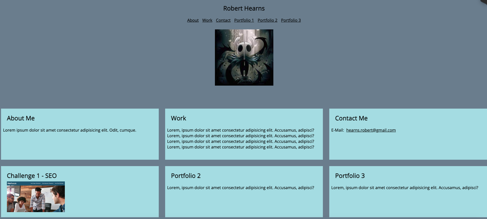

# challenge2portfolio

* [Description](#description)
* [Purpose](#purpose)
* [Usage](#usage)
* [Screenshots](#screenshots)
* [License](#license)

## Description
This website contains a portfolio and example of use of CSS grids, as well as Google Fonts

## Purpose
This is a portfolio as per spec of the requirements in the original README file (old-project-readme.md)

## Usage
Open index.html in any browser.

## Screenshots

## License
MIT license - included in LICENSE